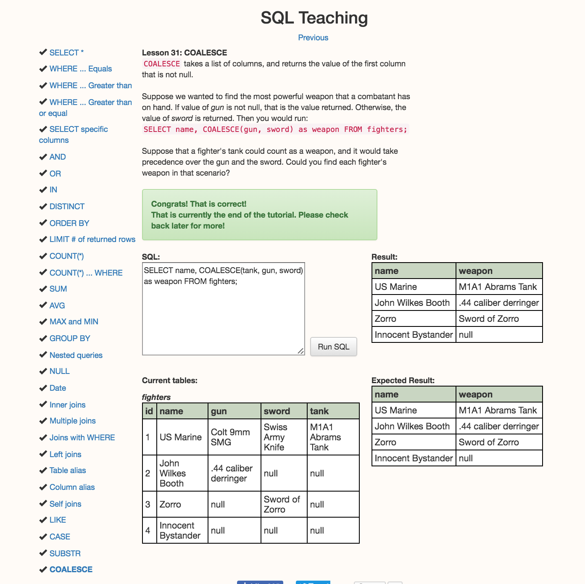

Answers to Explorer Mode Questions:

How many users are there?

sqlite> SELECT COUNT(*) FROM users;
COUNT(*)
50

2) What are the 5 most expensive items?

sqlite> SELECT title FROM items ORDER BY price DESC LIMIT 5;
title
Small Cotton Gloves
Small Wooden Computer
Awesome Granite Pants
Sleek Wooden Hat
Ergonomic Steel Car

3) What's the cheapest book? (Does that change for "category is exactly 'book'" versus "category contains ‘book'"?)

sqlite> SELECT * FROM items WHERE category LIKE '%Books%' ORDER BY price LIMIT 1;
id|title|category|description|price
76|Ergonomic Granite Chair|Books|De-engineered bi-directional portal|1496

Answer is: No, you get the same answer, but to ensure you include all categories that have the name ‘Books’ in the category, it is best that you use the search ‘%Books%’!

4) Who lives at "6439 Zetta Hills, Willmouth, WY”?

sqlite> SELECT users.first_name, users.last_name FROM users INNER JOIN addresses ON users.id = addresses.id WHERE addresses.street = '6439 Zetta Hills' AND addresses.city = 'Willmouth' AND addresses.state = 'WY';
first_name|last_name
Kyra|Kilback

Do they have another address?

sqlite> SELECT addresses.street, addresses.city, addresses.state FROM addresses INNER JOIN users ON users.id = addresses.id WHERE users.first_name = 'Kyra' AND users.last_name = 'Kilback';
street|city|state
6439 Zetta Hills|Willmouth|WY

Nope!

5) Correct Virginie Mitchell's address to "New York, NY, 10108”

sqlite> UPDATE addresses SET city = 'New York', state = 'NY', zip = 10108 WHERE addresses.id IN (SELECT users.id FROM users WHERE users.first_name = 'Virginie' AND users.last_name = 'Mitchell');
sqlite> SELECT addresses.street, addresses.city, addresses.state FROM addresses INNER JOIN users ON users.id = addresses.id WHERE users.first_name = 'Virginie' AND users.last_name = 'Mitchell';
street|city|state
7503 Cale Grove|New York|NY

6) How much would it cost to buy one of each tool?

sqlite> SELECT sum(price) AS "Total Cost of All Tools"  FROM items WHERE category LIKE '%Tool%';
Total Cost of All Tools
46477

7) How many total items did we sell?

sqlite> SELECT sum(quantity) AS "Total Quantity Sold" FROM orders;
Total Quantity Sold
2125

8) How much was spent on books?

sqlite> SELECT sum(orders.quantity * items.price) AS "Total Spent on Books" FROM orders INNER JOIN items ON items.id = orders.item_id WHERE items.category LIKE '%Books%';
Total Spent on Books
1081352

9) Simulate buying an item by inserting a User for yourself and an Order for that User.

Run COUNT first, then use next value for auto increment:

sqlite> INSERT INTO users VALUES (51, 'Marie', 'Denney', ‘mldenne@gmail.com');

Run SELECT on items to see a list of items:

sqlite> SELECT * FROM items;

Run COUNT on orders to find out next order number:

sqlite> SELECT COUNT(*) FROM orders;
COUNT(*)
377

Place order for Ergonomic Granite Computer, because why the hell not:

sqlite> INSERT INTO orders VALUES (378, 51, 68, 1, now);                             

And because I didn’t read Slack and didn’t realize ‘now’ won’t work, I now have to update the time…

sqlite> UPDATE orders SET created_at = '2016-07-11 17:10:00.000000' WHERE id = 378;

--------------
I decided to skip the Adventure Mode do the Epic Mode because a tutorial sounded fun - duh, should have known, but I got it done.

